# ESP32-S3 智能音箱终端软件架构设计文档

## 1. 系统概述

本项目以智能手表模块（ESP32-S3-Touch-LCD-1.28，PCB 1.0mm）为核心硬件，二次开发为一款**带小屏幕的智能音箱主控终端**。系统具备语音交互、1.28寸圆形LCD状态显示、触摸操作、Wi-Fi联网、蓝牙音频（A2DP）、姿态感知等能力。

- **主控芯片**：ESP32-S3（Xtensa LX7 双核 240MHz，512KB SRAM，内置 Wi-Fi + BT5.0）
- **开发框架**：ESP-IDF + FreeRTOS 多任务调度
- **UI 框架**：LVGL（适配 GC9A01 圆形屏）
- **语音能力**：云端大模型 API（ASR / NLP / TTS），本地仅做唤醒词检测（WakeWord）与音频流收发
- **调试接口**：Type-C → UART0 桥接（115200 bps）

---

## 2. 硬件组成（来自原理图）

| 模块 | 器件 | 接口 | 说明 |
|------|------|------|------|
| 主控 | ESP32-S3 | — | 双核 LX7，内置 Wi-Fi/BT |
| 显示屏 | 1.28寸 圆形 LCD (GC9A01) | SPI (FSPI) | DC / CS / CLK / MOSI / RST / BL |
| 触摸控制器 | TM1021Z-7 (CST816系) | I2C | 与 IMU 共用 I2C 总线 |
| IMU 传感器 | QMI8658C | I2C | 3轴加速度 + 3轴陀螺仪 |
| 外部 Flash | W25Q128VSSQ (128Mbit) | SPI (FSPI) | 存储音频资源 / 配置 / OTA |
| 电源管理 | ETA6096 充电IC | — | Li-ion 充电，最大 2.5A |
| LDO 稳压 | ME6217C33M5G | — | 输出 3.3V 系统电源 |
| 电池电量 | ADC (BAT_ADC) | ADC | 分压采样电池电压 |
| RTC 晶振 | 32.768kHz XTAL | — | 低功耗 RTC 时钟源 |
| 物理按键 | Key1 / Key2 | GPIO | 唤醒 / 功能切换 |
| 天线 | CA-003 PCB 天线 | — | Wi-Fi 2.4GHz / BT 5.0 |
| 麦克风 | 外接 I2S MEMS Mic | I2S | 语音采集（音箱扩展） |
| 扬声器 | 外接 I2S DAC + SPK | I2S | 音频播放（音箱扩展） |

> **注**：麦克风与扬声器为音箱功能扩展外接模块，通过 GPIO_OUT 扩展接口连接，原手表模块本身不含音频器件。

---

## 3. 软件分层结构

系统采用严格的 **四层架构**，确保业务逻辑与底层硬件解耦：

| 层级 | 名称 | 职责 |文件夹
|------|------|------|-----|
| L4 | 应用业务层 (Application Layer) | 产品逻辑：状态机、UI交互、语音会话、云端对接 |App|
| L3 | 中间件与服务层 (Middleware & Services) | 系统能力：LVGL、音频管道、网络协议栈、文件系统 |Mid|
| L2 | 驱动层 (Driver Layer) | 调用 ESP-IDF 官方接口实现 SPI/I2C/I2S/ADC 驱动，并为 L3(mid) 层提供统一接口 |driver|
| L1 | 物理硬件层 (Hardware Layer) | 实际器件：ESP32-S3 及所有外围硬件 |N/A|

---

## 4. 软件架构图

```mermaid
graph TD
    %% ── 样式定义 ──────────────────────────────────────────
    classDef appLayer  fill:#e3f2fd,stroke:#1e88e5,stroke-width:2px,color:#0d47a1;
    classDef midLayer  fill:#fff3e0,stroke:#fb8c00,stroke-width:2px,color:#e65100;
    classDef driverLayer  fill:#e8f5e9,stroke:#43a047,stroke-width:2px,color:#1b5e20;
    classDef hwLayer   fill:#f3e5f5,stroke:#8e24aa,stroke-width:2px,color:#4a148c;
    classDef extLayer  fill:#fce4ec,stroke:#e53935,stroke-width:1px,stroke-dasharray:4,color:#880e4f;

    %% ══════════════════════════════════════════════════════
    %% L4  应用业务层
    %% ══════════════════════════════════════════════════════
    subgraph APP["L4 · 应用业务层 (Application Layer)"]
        direction LR
        APP_Main["系统状态机\napp_main / sys_fsm"]:::appLayer
        APP_Voice["语音会话控制器\nVoice Session Ctrl"]:::appLayer
        APP_UI["UI 视图管理\nLVGL Screen Manager"]:::appLayer
        APP_Net["网络配网管理\nWi-Fi Provisioning"]:::appLayer
        APP_BT["蓝牙音频接入\nA2DP Sink"]:::appLayer
        APP_IMU["姿态事件处理\nGesture / Step"]:::appLayer
        APP_PWR["电源管理\nBattery Monitor"]:::appLayer
        APP_OTA["OTA 升级\nHTTPS OTA"]:::appLayer
    end

    %% ══════════════════════════════════════════════════════
    %% L3  中间件与服务层
    %% ══════════════════════════════════════════════════════
    subgraph MID["L3 · 中间件与服务层 (Middleware & Services)"]
        direction LR
        MID_LVGL["LVGL 图形引擎\nv8.x · GC9A01适配"]:::midLayer
        MID_Audio["ESP-ADF 音频管道\nRingBuffer · Codec"]:::midLayer
        MID_VAD["本地唤醒引擎\nWakeWord / VAD"]:::midLayer
        MID_Cloud["大模型流式API客户端\nASR→NLP→TTS"]:::midLayer
        MID_WiFi["Wi-Fi / TCP / TLS\nesp_netif · mbedTLS"]:::midLayer
        MID_BLE["BLE 协议栈\nNimBLE / Bluedroid"]:::midLayer
        MID_FS["文件系统\nNVS · SPIFFS · FatFS"]:::midLayer
        MID_Log["日志服务\nuart_log · esp_log"]:::midLayer
    end

    %% ══════════════════════════════════════════════════════
    %% L2  驱动层
    %% ══════════════════════════════════════════════════════
    subgraph DRIVER["L2 · 驱动层 (Driver Layer)"]
        direction LR
        DRIVER_LCD["SPI LCD 驱动\nGC9A01 · FSPI"]:::driverLayer
        DRIVER_TP["I2C 触摸驱动\nTM1021Z-7 / CST816"]:::driverLayer
        DRIVER_IMU["I2C IMU 驱动\nQMI8658C"]:::driverLayer
        DRIVER_I2S["I2S 音频驱动\n录音 · 播放 · PDM"]:::driverLayer
        DRIVER_Flash["SPI Flash 驱动\nW25Q128 · esp_flash"]:::driverLayer
        DRIVER_ADC["ADC 驱动\n电池电压采样"]:::driverLayer
        DRIVER_GPIO["GPIO 驱动\nKey1/Key2 · BL · RST"]:::driverLayer
    end

    %% ══════════════════════════════════════════════════════
    %% L1  物理硬件层
    %% ══════════════════════════════════════════════════════
    subgraph HW["L1 · 物理硬件层 (Hardware)"]
        direction LR
        HW_S3[/"ESP32-S3\nLX7 240MHz · 512KB SRAM"\]:::hwLayer
        HW_LCD[/"1.28寸 圆形 LCD\nGC9A01 · 240×240"\]:::hwLayer
        HW_TP[/"触摸控制器\nTM1021Z-7"\]:::hwLayer
        HW_IMU[/"IMU\nQMI8658C 6轴"\]:::hwLayer
        HW_Flash[/"外部 Flash\nW25Q128 128Mbit"\]:::hwLayer
        HW_XTAL[/"RTC 晶振\n32.768kHz"\]:::hwLayer
        HW_BAT[/"锂电池\n+ ETA6096 充电IC"\]:::hwLayer
        HW_UART[/"Type-C UART桥\nUART0 115200"\]:::hwLayer
        HW_KEY[/"Key1 / Key2\nGPIO 按键"\]:::hwLayer
        HW_Mic[/"I2S MEMS 麦克风\n外接扩展"\]:::hwLayer
        HW_Spk[/"I2S DAC + 扬声器\n外接扩展"\]:::hwLayer
    end

    %% ══════════════════════════════════════════════════════
    %% 外部云端服务
    %% ══════════════════════════════════════════════════════
    subgraph CLOUD["外部云端服务"]
        direction LR
        CLD_ASR["ASR 语音识别\n(百度/阿里/讯飞)"]:::extLayer
        CLD_NLP["NLP 大模型\n(OpenAI/文心/百炼)"]:::extLayer
        CLD_TTS["TTS 语音合成\n(流式 PCM 返回)"]:::extLayer
    end

    %% ══════════════════════════════════════════════════════
    %% 层间连接：L4 → L3
    %% ══════════════════════════════════════════════════════
    APP_Main  --> APP_Voice
    APP_Main  --> APP_UI
    APP_Main  --> APP_Net
    APP_Main  --> APP_BT
    APP_Main  --> APP_IMU
    APP_Main  --> APP_PWR
    APP_Main  --> APP_OTA

    APP_UI    --> MID_LVGL
    APP_Voice --> MID_Audio
    APP_Voice --> MID_VAD
    APP_Voice --> MID_Cloud
    APP_Net   --> MID_WiFi
    APP_BT    --> MID_BLE
    APP_PWR   --> MID_Log
    APP_OTA   --> MID_WiFi
    APP_Main  --> MID_FS
    APP_Main  --> MID_Log

    %% L3 内部依赖
    MID_Cloud --> MID_WiFi
    MID_VAD   --> MID_Audio

    %% ══════════════════════════════════════════════════════
    %% 层间连接：L3 → L2
    %% ══════════════════════════════════════════════════════
    MID_LVGL  --> DRIVER_LCD
    MID_LVGL  --> DRIVER_TP
    MID_Audio --> DRIVER_I2S
    MID_FS    --> DRIVER_Flash
    MID_Log   --> DRIVER_UART
    APP_IMU   --> DRIVER_IMU
    APP_PWR   --> DRIVER_ADC
    APP_Main  --> DRIVER_GPIO

    %% ══════════════════════════════════════════════════════
    %% 层间连接：L2 → L1
    %% ══════════════════════════════════════════════════════
    DRIVER_LCD   --> HW_LCD
    DRIVER_TP    --> HW_TP
    DRIVER_IMU   --> HW_IMU
    DRIVER_I2S   --> HW_Mic
    DRIVER_I2S   --> HW_Spk
    DRIVER_Flash --> HW_Flash
    DRIVER_UART  --> HW_UART
    DRIVER_ADC   --> HW_BAT
    DRIVER_GPIO  --> HW_KEY

    %% ══════════════════════════════════════════════════════
    %% 云端连接
    %% ══════════════════════════════════════════════════════
    MID_Cloud --> CLD_ASR
    MID_Cloud --> CLD_NLP
    MID_Cloud --> CLD_TTS
```



---

## 5. 关键数据流

### 5.1 语音交互流程

```
[I2S Mic] → DRIVER_I2S → MID_Audio(RingBuffer)
    → MID_VAD(唤醒检测)
        → [唤醒] → MID_Cloud → CLD_ASR(语音→文字)
                             → CLD_NLP(文字→回复)
                             → CLD_TTS(回复→PCM流)
                   ← PCM流 ← MID_Audio(播放管道)
                             → DRIVER_I2S → [I2S DAC + SPK]
    → APP_UI 同步显示对话状态（LVGL）
```

### 5.2 UI 渲染流程

```
APP_UI(视图逻辑) → MID_LVGL(绘制指令)
    → DRIVER_LCD(SPI DMA 传输) → HW_LCD(GC9A01 圆屏)
DRIVER_TP(I2C 中断) → MID_LVGL(触摸事件) → APP_UI(手势响应)
```

### 5.3 姿态感知流程

```
HW_IMU(QMI8658C) → DRIVER_IMU(I2C 轮询/中断)
    → APP_IMU(计步 / 抬腕亮屏 / 跌落检测)
        → APP_Main(状态切换) → APP_UI(屏幕唤醒)
```

### 5.4 电源管理流程

```
HW_BAT(锂电池) → DRIVER_ADC(电压采样)
    → APP_PWR(电量计算 / 低电告警)
        → APP_UI(电量图标更新)
ETA6096(充电IC) → [硬件自动管理，GPIO 检测充电状态]
```


---


## 6. 关键接口总线分配（原理图）

| 总线 | 用途 | 相关器件 |
|------|------|----------|
| FSPI (SPI) | LCD 显示 + 外部 Flash | GC9A01, W25Q128 |
| I2C0 | 触摸 + IMU | TM1021Z-7, QMI8658C |
| I2S0 | 麦克风采集 | 外接 MEMS Mic |
| I2S1 | 扬声器播放 | 外接 I2S DAC |
| UART0 | 调试日志 / 烧录 | Type-C UART 桥 |
| ADC1 | 电池电压检测 | BAT_ADC 分压电路 |
| GPIO | 按键 / 背光 / LCD控制 | Key1, Key2, BL, DC, RST |
